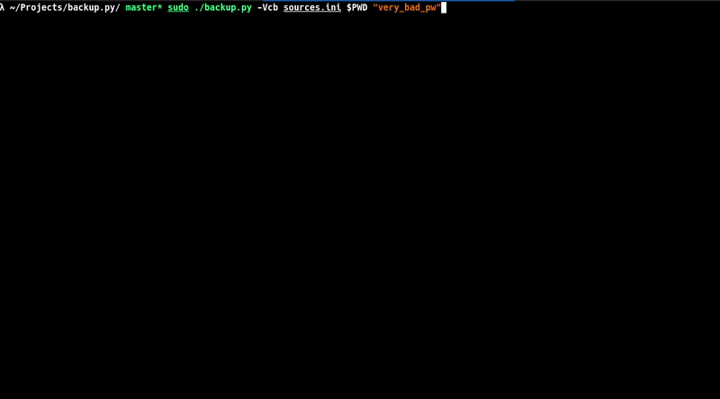

<div align="center">
    <h1>backup.py</h1>
    <h6><i>Modular and lightweight backup utility to save, encrypt and verify your personal data.</i></h6>
    <br />
    
</div>
  
## Usage
`backup.py` supports two major options: `--backup`, to create a new backup and `--extract`
to extract an existing backup archive.

In order to create a backup file, you first need to create a *"sources file"* to specify
the absolute paths to backup. For instance:

```ini
# directories end with a slash...
photos=/home/marco/Pictures/
documents=/home/marco/Documents/
# while individual files do not
wireguard=/etc/wireguard/wg0.conf
```

Then, you can start the backup process with the following command:

```sh
$ sudo ./backup.py --verbose --checksum --backup sources.ini $PWD "very_bad_pw"
Copying photos (1/3)...DONE (0.02s)
Computing checksums...DONE (0.01s)
 computing [██████████████████████████████] 100.0% (5/5): 'Screenshot From 2026-01-22....png'

Copying documents (2/3)...DONE (3.39s)
Computing checksums...DONE (1.26s)
 computing [██████████████████████████████] 100.0% (7881/7881): 'master'

Copying wireguard (3/3)...DONE (0.00s)
Computing checksums...DONE (0.00s)
 computing [██████████████████████████████] 100.0% (1/1): 'wg0.conf'

Compressing backup...DONE (22.52s)
 compressing [██████████████████████████████] 100.0% (8355/8354): 'rec2.jpg'

Encrypting backup...DONE (0.90s)

+---------------+------------------------------------------------------------------+
| File name     | '/home/marco/Projects/backup.py/backup-wood-20260129.tar.gz.enc' |
+---------------+------------------------------------------------------------------+
| Checksum file | '/home/marco/Projects/backup.py/backup-wood-20260129.sha256'     |
+---------------+------------------------------------------------------------------+
| File size     | 344165145 bytes (328.22 MiB)                                     |
+---------------+------------------------------------------------------------------+
| Elapsed time  | 23 seconds                                                       |
+---------------+------------------------------------------------------------------+
```

The `--checksum` (optional) is used to generate a checksum file containing the hashes of each single of the backup.
You can also omit the `--verbose` flag to run the program in quiet mode.

To extract an existing backup, you can instead issue the following command:

```sh
$ ./backup.py --verbose --checksum --extract backup-wood-20260129.tar.gz.enc "very_bad_pw" backup-wood-20260129.sha256
Decrypting backup...DONE (0.76s)
Extracting backup...DONE (6.93s)
 extracting [██████████████████████████████] 100.0% (8355/8355): 'rec2.jpg'
Verifying backup...DONE (0.89s)
 verifying [██████████████████████████████] 100.0% (7887/7887): 'master'

Backup extracted to: '/home/marco/Projects/backup.py/backup.py.tmp'
Elapsed time: 8 seconds
```

This will create a new directory named `backup.py.tmp` on your local path. Just like before,
the `-c` option is optional.

## Installation
As stated before, `python.py` is built from scratch in modern Python (3.10+) without using 
any external library except for `tar` and `gpg`. The program will automatically check whether
these dependencies are installed at startup.

You can therefore copy the program wherever you like. For instance, to install it under `/usr/bin/python.py`, issue
the following command:

```sh
$ sudo cp -Rv "$(pwd)/backup.py" /usr/bin/backup.py
```

## Technical details
The *sources file* follows an INI-like syntax built using associative records between
labels and absolute paths. In order words:

```ini
<label>=<path>
```

where:
- `<label>` is a descriptive name of a backup entry;  
- `<path>` is the absolute path to a directory or a file.

For example:

```ini
# File 'server_backup.ini'
# List directories and files to backup
#
nginx=/etc/nginx/
ssh=/etc/ssh/
www=/var/www/html/

# no slash here ----v
host_file=/etc/hosts
```

As you can see, individual files are specified by omitting the trailing slash at the end
of the absolute path. Comments, on the other hand, are inserted using the `#` token. Blank
lines are ignored.

Internally, `backup.py` orchestrates several UNIX utilities to create backups. In particular,
it follows the procedure listed below:

1. **Copy phase**: uses Python `shutil.copytree()` to copy files while preserving metadata and
symlinks (without following them) and by ignoring special files;  
2. **Compression**: creates a gzip-compressed tar archive using GNU tar;  
3. **Encryption**: encrypts the archive with GPG using AES-256 symmetric encryption;  
4. **Checksum** (optional): computes SHA256 hashes for each file in the backup archive.

The backup process creates temporary files in `backup.py.tmp` and `backup.py.tar.gz`, which are
automatically cleaned up on completion or interruption (i.e., `C-c`).

## Old version
This implementation of `backup.py` is a porting of an old backup script originally written in Bash
that I developed back in 2018. While this new version should be compatible with old backup archives,
it may start to diverge at a certain point in the future. If you're experience incompatibilities and want
to revert to the original version, you can do so by visiting the 
[latest stable commit](https://git.marcocetica.com/marco/backup.py/src/commit/786c30ef14abe2056dfa5cb250b766db73ca71aa).

## License
This software is released under GPLv3. You can obtain a copy of this license by visiting [this page](https://choosealicense.com/licenses/gpl-3.0/).
